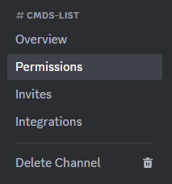
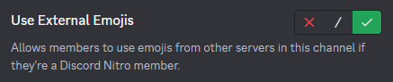

# 😀 External Emojis

<figure><figcaption>
Go to the channel where the emojis aren't showing up and click on the gear icon.
</figcaption></figure>

<figure><figcaption>
After that go to the "Permissions" tab.
</figcaption></figure>

<figure><figcaption>
Next you need to go to the role "@everyone".
</figcaption></figure>

<figure><figcaption>
On the right scroll down till you see "Use External Emojis" and enable it.
</figcaption></figure>


These steps have to be down for every channel and can't be down in the roles settings.

